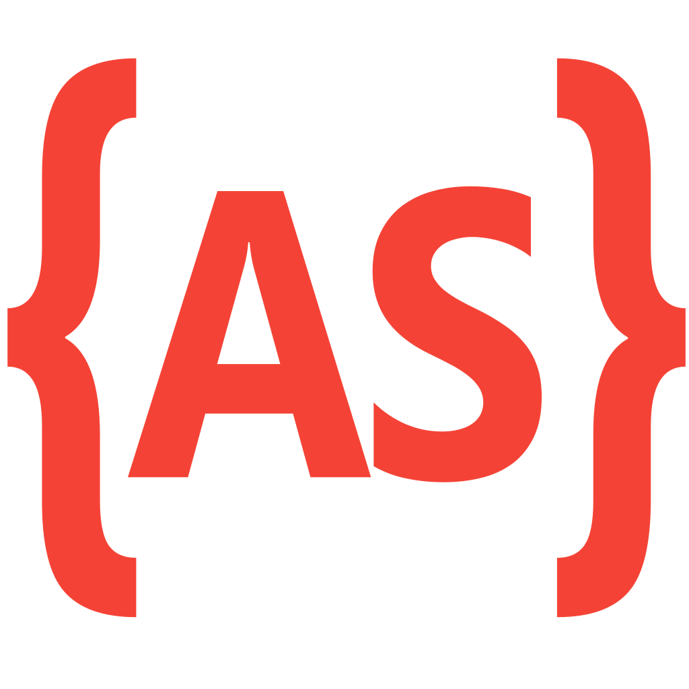

<!-- LOGO -->

  

  <h1 align="center">Aqui Tem Joinville</h1>

  

  
A city-wide web portal for Joinville, SC, offering news, events, classifieds, business listings, recipes, and local services — all in one place.

  
// city portal · joinville, sc · 2008

   

<a href="https://webarchive.leonardolimadevasconcellos.workers.dev/aquitemjoinville"><strong>View it live »</strong></a>

 

<!-- SHIELDS -->

[![Creator Website][website-shield]][website-url]
[![Contributors][contributors-shield]][contributors-url]
[![Forks][forks-shield]][forks-url]
[![Issues][issues-shield]][issues-url]
[![LinkedIn][linkedin-shield]][linkedin-url]
[![Released][year-shield]][year-url]

<!-- TABLE OF CONTENTS -->

  
Table of Contents

  <ol>
    <li><a href="#about-the-project">About The Project</a></li>
    <li><a href="#screenshots">Screenshots</a></li>
    <li><a href="#built-with">Built With</a></li>
    <li><a href="#roadmap">Roadmap</a></li>
    <li><a href="#contributors">Contributors</a></li>
    <li><a href="#contact">Contact</a></li>
  </ol>

<!-- ABOUT THE PROJECT -->

## About The Project

[![Product Screenshot][product-screenshot]](https://leonardo-vasconcellos.vercel.app/portfolio/aquitemjoinville)

<!-- PROJECT INTRO: 260 chars max -->

A city-wide web portal for Joinville, SC, offering news, events, classifieds, business listings, recipes, and local services. Launched in 2008, it served as the city's digital hub connecting residents with local businesses.

<!-- END INTRO -->

Founded on December 12, 2008, **Aqui Tem Joinville** was Joinville's answer to national portals like UOL and Terra — a single destination where residents of the city and surrounding region could find everything local, online.

**What was built:**

The platform delivered a comprehensive suite of services from a single domain:

- **News & Editorial Content** — locally written articles covering events, health, fashion, and sports, giving the portal editorial credibility and repeat traffic.
- **Classifieds & Business Directory (Yellow Pages)** — a structured database of local businesses, commerce, and services organized by category, allowing residents to find and contact providers quickly. For hundreds of local businesses, this was their first digital presence.
- **Events Calendar** — a curated listing of cultural and civic events in Joinville, driving community engagement and repeat visits.
- **Recipes & Lifestyle** — content verticals that broadened the portal's audience beyond news readers and kept dwell time high.
- **Useful Links & Web Directory** — a curated index of local and relevant web resources, functioning as a regional gateway to the internet.
- **Polls** — community participation features that increased engagement and time-on-site.
- **Sponsored Banner Advertising** — a tiered advertising network with multiple banner placements across the site, generating revenue and giving local businesses an affordable, targeted channel to reach Joinville's online audience.

**Business impact:**

The portal directly enabled local commerce growth at a pivotal moment — 2008, when internet adoption was accelerating in mid-sized Brazilian cities but hyper-local online platforms barely existed. By providing an ad-supported business directory and classifieds platform, the project created measurable ROI for advertisers: their listings and banners reached a geographically concentrated audience that national portals could not serve. The yellow pages feature alone gave dozens of local businesses their first searchable online presence. The ad network provided a low-barrier entry point for businesses with no prior digital advertising budget.

Technically, the project combined a PHP/Mambo CMS backend — responsible for managing multiple content sections simultaneously — with an Adobe Flex-powered interactive layer that enhanced the browsing experience beyond what plain HTML/JavaScript could offer in 2008. The MySQL-backed classifieds and directory engine was designed for efficient search and filtering, the critical path for any yellow pages product.

### Key Features

- **Searchable yellow-pages engine** — I designed a category-driven MySQL business directory with fast search and filtering, giving hundreds of local businesses their first online presence and turning the portal into the region's go-to place to find a service.
- **Tiered banner ad network** — I built a multi-placement sponsored-advertising system on top of the Mambo CMS, creating the site's revenue engine and a low-barrier, geographically targeted channel that let small Joinville businesses advertise online for the first time.
- **Multi-vertical content platform** — I unified news, events, classifieds, recipes, polls, and a web directory under one PHP/Flex codebase, broadening the audience beyond news readers and sustaining the repeat traffic and dwell time that made ad inventory valuable.

(<a href="#readme-top">back to top</a>)

<!-- SCREENSHOTS -->

## Screenshots

  
  
  
  
  
  

(<a href="#readme-top">back to top</a>)

<!-- BUILT WITH -->

## Built With

<!-- LANGUAGES -->

**Languages**

|                                                                                                                | Language     | Version |
| -------------------------------------------------------------------------------------------------------------- | ------------ | ------- |
|                | PHP          | 5.2     |
|  | JavaScript   | ES5     |
|                                                               | ActionScript | 3.0     |
|            | HTML         | 5       |
|              | CSS          | 3       |

<!-- FRAMEWORKS & LIBRARIES -->

**Frameworks & Libraries**

|                                                                                                        | Framework   | Version |
| ------------------------------------------------------------------------------------------------------ | ----------- | ------- |
|                                                       | Mambo CMS   | 4.6     |
|      | Apache Flex | 3.0     |
|  | Adobe Flash | CS4     |
|    | MySQL       | 5.1     |

(<a href="#readme-top">back to top</a>)

<!-- ROADMAP -->

## Roadmap

This project repository is for archive purposes only. No new features or issues are being tracked.

(<a href="#readme-top">back to top</a>)

<!-- CONTRIBUTORS -->

## Contributors

(<a href="#readme-top">back to top</a>)

<!-- CONTACT -->

## Contact

[Leonardo Vasconcellos - Website](https://leonardo-vasconcellos.vercel.app/) — [LinkedIn](https://www.linkedin.com/in/llvasconcellos)

(<a href="#readme-top">back to top</a>)

<!-- MARKDOWN LINKS & IMAGES -->

[website-shield]: https://img.shields.io/badge/Creator_Website-%E2%86%97-2eba7a?style=for-the-badge
[website-url]: https://leonardo-vasconcellos.vercel.app/
[contributors-shield]: https://img.shields.io/github/contributors/llvasconcellos2/aquitemjoinville.svg?style=for-the-badge
[contributors-url]: https://github.com/llvasconcellos2/aquitemjoinville/graphs/contributors
[forks-shield]: https://img.shields.io/github/forks/llvasconcellos2/aquitemjoinville.svg?style=for-the-badge
[forks-url]: https://github.com/llvasconcellos2/aquitemjoinville/network/members
[issues-shield]: https://img.shields.io/github/issues/llvasconcellos2/aquitemjoinville.svg?style=for-the-badge
[issues-url]: https://github.com/llvasconcellos2/aquitemjoinville/issues
[linkedin-shield]: https://img.shields.io/badge/-LinkedIn-0A66C2?style=for-the-badge&logo=linkedin&logoColor=white
[linkedin-url]: https://www.linkedin.com/in/llvasconcellos
[year-shield]: https://img.shields.io/badge/Released-2008-gray?style=for-the-badge
[year-url]: #
[product-screenshot]: screenshots/layout.png
